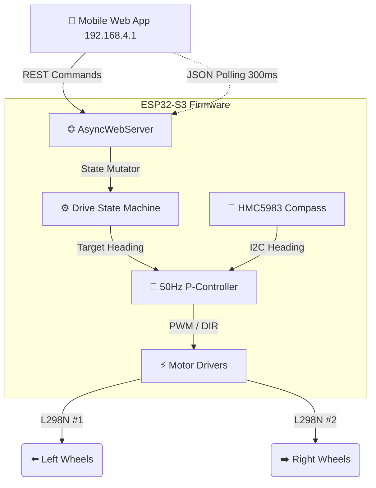

<div align="center">
  

  # ⚡ 4WD Mecanum Robot &middot; ESP32-S3

  **Next-Gen Omni-Directional Mobility System with Magnetic Heading Stabilization**  
  *Fully self-hosted Web UI &middot; IMU Telemetry &middot; 8-Way Strafe*

  <p align="center">
    
    
    
    
  </p>
</div>

<br />

> **Welcome to the future of robotics.** This project transforms an ESP32-S3 hardware platform into an advanced, omni-directional rover. By bridging dual L298N motor drivers equipped with mecanum wheels and an HMC5983 magnetometer, the rover achieves absolute heading control and lateral agility, managed entirely from an embedded, blazing-fast neon Web HUD.

---

## ✨ System Features

- 🏎️ **Omni-Directional Drive**: 8-way mecanum mobility. Forward, backward, spin, pure lateral strafe, and 45° diagonal gliding.
- 🧭 **Magnetic Heading Lock**: An integrated HMC5983 compass provides absolute heading while the MPU6500 gyroscope smooths motion with a complementary filter, keeping the robot straight and reducing turn overshoot.
- 🎯 **Precise Angle Execution**: Command exact relative rotations (e.g., +90°, -45°) via an interactive circular UI dial. The rover rotates and automatically halts precisely on the target vector.
- 🛜 **Embedded WiFi AP & Server**: No bridges. No latency. The ESP32-S3 broadcasts its own high-speed `4WD-Car` hotspot and serves the UI directly via `ESPAsyncWebServer`.
- 🌌 **Neon Glassmorphism UI**: Beautiful, dark-themed responsive app interface accessible from any mobile browser, featuring an animated 360° Compass HUD and D-Pad.

<br />

## 🧠 Architecture Overview

The system strictly decouples high-level web interactions from critical control loops. The `loop()` executes real-time 50Hz P-Control for magnetic stabilization, while `AsyncWebServer` handles asynchronous REST inputs from the Web-App.



<br />

## ⚙️ Hardware Matrix & Pinout

### MCU & Sensors
| Component | ESP32-S3 Pin | Notes |
| :--- | :--- | :--- |
| **HMC5983 SDA** | `GPIO 1` | I2C Data |
| **HMC5983 SCL** | `GPIO 2` | I2C Clock |

### Motor Control Layout
The system uses **two L298N Motor Drivers** grouped by side to power four mecanum wheels.

> **Mecanum Configuration (Top View)**  
> ↖️ `FL` &nbsp;&nbsp;&nbsp;&nbsp;&nbsp;&nbsp; `FR` ↗️  
> ↙️ `RL` &nbsp;&nbsp;&nbsp;&nbsp;&nbsp;&nbsp; `RR` ↘️  
> *(Roller angles must form an internal 'X' pattern when viewed from above)*

<details>
<summary><b>View Detailed Pinout for L298N #1 (Left Side)</b></summary>

| Motor | IN A | IN B | PWM (EN) | ESP32-S3 Channels |
| :--- | :--- | :--- | :--- | :--- |
| **Front-Left (FL)** | `GPIO 4` | `GPIO 5` | **`GPIO 15`** | `LEDC CH 0` |
| **Rear-Left (RL)** | `GPIO 7` | `GPIO 6` | **`GPIO 16`** | `LEDC CH 1` |
</details>

<details>
<summary><b>View Detailed Pinout for L298N #2 (Right Side)</b></summary>

| Motor | IN A | IN B | PWM (EN) | ESP32-S3 Channels |
| :--- | :--- | :--- | :--- | :--- |
| **Front-Right (FR)** | `GPIO 17` | `GPIO 18` | **`GPIO 10`** | `LEDC CH 2` |
| **Rear-Right (RR)** | `GPIO 8` | `GPIO 9` | **`GPIO 11`** | `LEDC CH 3` |
</details>

<br />

## 🚀 Ignition sequence (Getting Started)

1. **Clone & Open**: Open the project folder in VS Code with the PlatformIO extension.
2. **Build & Flash**: Ensure your ESP32-S3 is connected.
   ```bash
   pio run -t upload
   ```
3. **Connect to Uplink**: 
   - Connect your smartphone/PC Wifi to `4WD-Car` (No password required).
   - Open a browser and navigate to `http://192.168.4.1`

<br />

## 🕹️ HUD Terminal Guide

Upon loading the Web UI, you have access to four primary control panels:

1. **Compass Telemetry**: Displays fused heading, raw compass heading, and live IMU telemetry in real-time. Features an interactive toggle to turn off **Compass Assist** (allowing free driving without P-Control locking). Includes a **Calibration** sequencer to calculate hard-iron magnetic offsets and a gyro recalibration button.
2. **Thrust Vectoring**: A slider to modulate the absolute PWM limit (80-255).
3. **Mecanum D-Pad**: Multi-touch capable control grid for 8-axis movement (FWD, BWD, strafe sideways, dual-axis diagonals).
4. **Precision Orientation**: Input precise rotational angles via the futuristic circular swipe-dial or quick-tap preset buttons to let the rover autonomously execute the maneuver.
5. **Standalone Preview**: Open [ui_preview.html](/Volumes/Pasan_s_SSD/PlatformIO/Projects/4WD_Bluetooth/ui_preview.html) in a browser to test the shared HUD layout offline with mock data before syncing it into the embedded UI.

---

<div align="center">
  <sub>Developed for the ESP32-S3 Platform | Powered by PlatformIO</sub>
</div>
